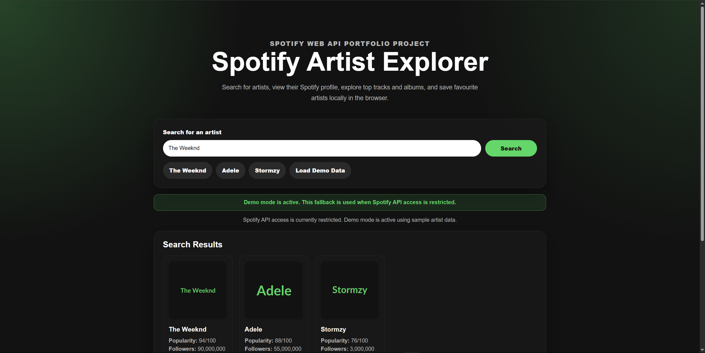
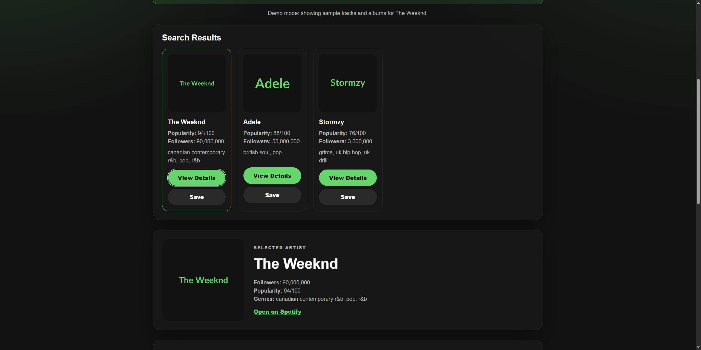
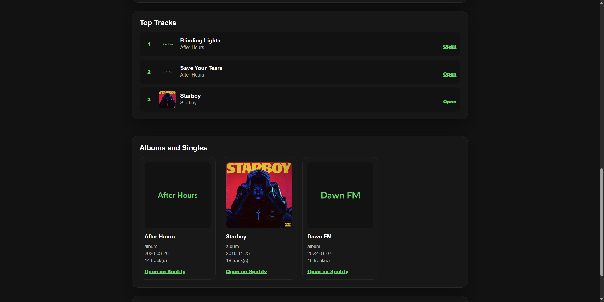
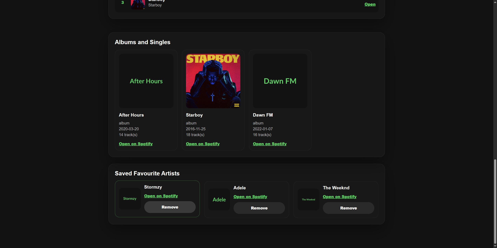
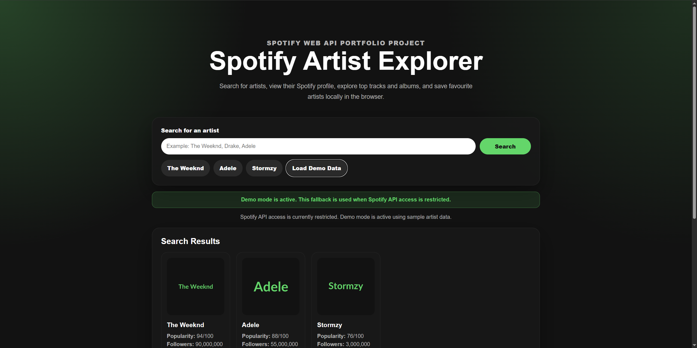

# Spotify Artist Explorer

Spotify Artist Explorer is a full-stack React and Node.js web application that allows users to search for artists, explore albums and top tracks, and save favourite artists locally in the browser.

The application integrates with the Spotify Web API and includes an automatic fallback demo mode so the interface remains functional even when Spotify API access is unavailable.

## Project Highlights

* Full-stack application using React and Express
* Spotify Web API integration
* REST API architecture
* Local storage implementation for favourites
* Responsive user interface
* Error handling and API fallback system
* Reusable React component structure
* Environment variable configuration for security

---

## Screenshots

### Homepage


### Search Results



### Artist Details



### Albums and Top Tracks



### Favourites System



### Demo Mode



---

## Features

* Search for artists using the Spotify Web API
* View artist profile information
* Display popularity scores and follower counts
* Browse genres
* View top tracks
* Explore albums and singles
* Open content directly in Spotify
* Save favourite artists using localStorage
* Remove favourite artists
* Automatic fallback demo mode
* Responsive Spotify-inspired interface

---

## Technologies Used

### Frontend

* React
* Vite
* JavaScript
* CSS

### Backend

* Node.js
* Express
* Axios
* Dotenv
* CORS

### API

* Spotify Web API

### Browser Storage

* localStorage

---

## Architecture Overview

```text
React Frontend
       │
       ▼
Express Backend
       │
       ▼
Spotify Web API
       │
       ▼
Artist / Album / Track Data
```

The frontend communicates with a custom Express server which handles authentication and requests to Spotify. This prevents API credentials from being exposed in the browser.

---

## Demo Mode

Spotify may restrict access to development applications depending on account status and API permissions.

If Spotify data cannot be retrieved, the application automatically switches to demo mode.

Demo mode loads local artist, album and track data so the application remains fully usable and demonstrates graceful handling of third-party API failures.

---

## Installation

Clone the repository:

```bash
git clone https://github.com/YOUR_USERNAME/spotify-artist-explorer.git
```

Navigate into the project folder:

```bash
cd spotify-artist-explorer
```

Install dependencies:

```bash
npm install
```

---

## Environment Variables

Create a `.env` file in the project root.

Example:

```env
SPOTIFY_CLIENT_ID=your_client_id
SPOTIFY_CLIENT_SECRET=your_client_secret
PORT=5000
```

A sample configuration is provided in `.env.example`.

Do not commit your `.env` file to GitHub.

---

## Running the Application

The project requires two terminals because the frontend and backend run independently.

### Terminal 1 – Backend Server

```bash
npm run server
```

Expected output:

```text
Server running on http://localhost:5000
```

### Terminal 2 – Frontend

```bash
npm run dev
```

Expected output:

```text
Local: http://localhost:5173/
```

Open the displayed URL in your browser.

---

## Using the Application

1. Search for an artist.
2. Select an artist from the results.
3. View profile information.
4. Explore top tracks and albums.
5. Save artists to favourites.
6. If Spotify access is unavailable, demo mode activates automatically.

---

## Project Structure

```text
spotify-artist-explorer/
├── src/
│   ├── components/
│   │   ├── SearchBar.jsx
│   │   ├── ArtistCard.jsx
│   │   ├── TopTracks.jsx
│   │   ├── AlbumGrid.jsx
│   │   └── Favourites.jsx
│   ├── App.jsx
│   ├── App.css
│   ├── demoData.js
│   ├── index.css
│   └── main.jsx
├── server.js
├── package.json
├── .env.example
└── README.md
```

---

## API Endpoints

```text
GET /api/health
GET /api/search-artist?q=artistName
GET /api/artist/:id/albums
GET /api/artist/:id/top-tracks
```

---

## Future Improvements

* Artist comparison dashboard
* Recently searched artists
* Advanced filtering and sorting
* Listening statistics and charts
* User authentication
* Cloud deployment
* Automated testing
* Docker containerisation

---

## Skills Demonstrated

* React development
* REST API integration
* Express backend development
* State management
* Component-based architecture
* Local storage
* Environment variable management
* Error handling
* Responsive web design
* Full-stack application development

---

## Author

Developed by Y. Ali as a portfolio project to demonstrate modern web development practices using React, Node.js, Express and third-party API integration.
