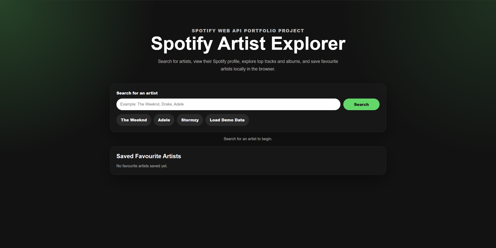

# Spotify Artist Explorer

Spotify Artist Explorer is a full-stack React and Node.js web application that allows users to search for artists, view artist information, explore albums and top tracks, and save favourite artists locally in the browser.

The application integrates with the Spotify Web API and includes a fallback demo mode to ensure the interface remains usable when Spotify API access is restricted.

---

## Screenshot



## Features

* Search for artists using the Spotify Web API
* View artist profile information
* Display artist popularity scores and follower counts
* View artist genres
* Browse albums and singles
* View top tracks
* Open artists, tracks and albums directly in Spotify
* Save favourite artists using localStorage
* Remove favourite artists
* Automatic demo mode fallback when Spotify API access is unavailable
* Responsive Spotify-inspired user interface

---

## Technologies Used

### Frontend

* React
* Vite
* JavaScript
* CSS

### Backend

* Node.js
* Express
* Axios
* Dotenv
* CORS

### API

* Spotify Web API

### Browser Storage

* localStorage

---

## Demo Mode

Spotify currently applies restrictions to some development applications.

If live Spotify API access is unavailable, the application automatically switches to demo mode.

Demo mode loads local sample artist, album and track data, allowing the application to remain fully functional and demonstrating fallback handling for third-party API limitations.

---

## How It Works

The Express backend requests an access token from Spotify using the Client Credentials Flow.

The React frontend communicates with the backend rather than directly communicating with Spotify. This prevents Spotify credentials from being exposed in the browser.

The backend provides endpoints for:

* Artist search
* Album retrieval
* Top track retrieval

The frontend displays this data using reusable React components and stores favourite artists in localStorage.

---

## Installation

Clone the repository:

```bash
git clone https://github.com/YOUR_USERNAME/spotify-artist-explorer.git
```

Navigate into the project folder:

```bash
cd spotify-artist-explorer
```

Install dependencies:

```bash
npm install
```

---

## Environment Variables

Create a file called:

```text
.env
```

Add the following:

```env
SPOTIFY_CLIENT_ID=your_client_id
SPOTIFY_CLIENT_SECRET=your_client_secret
PORT=5000
```

Do not upload this file to GitHub.

---

## Running the Application

The project requires two terminals because the frontend and backend run separately.

### Terminal 1 – Backend Server

Start the Express server:

```bash
npm run server
```

Expected output:

```text
Server running on http://localhost:5000
```

---

### Terminal 2 – React Frontend

Start the Vite development server:

```bash
npm run dev
```

Expected output:

```text
Local: http://localhost:5173/
```

Open the displayed URL in your browser.

---

## Using the Application

1. Enter an artist name.
2. Click Search.
3. Select an artist from the results.
4. View artist details, albums and top tracks.
5. Save favourite artists.
6. If Spotify API access is unavailable, demo mode will automatically activate.

---

## Project Structure

```text
spotify-artist-explorer/
├── src/
│   ├── components/
│   │   ├── SearchBar.jsx
│   │   ├── ArtistCard.jsx
│   │   ├── TopTracks.jsx
│   │   ├── AlbumGrid.jsx
│   │   └── Favourites.jsx
│   ├── App.jsx
│   ├── App.css
│   ├── demoData.js
│   ├── index.css
│   └── main.jsx
├── server.js
├── package.json
├── .env
└── README.md
```

---

## API Endpoints

```text
GET /api/health
GET /api/search-artist?q=artistName
GET /api/artist/:id/albums
GET /api/artist/:id/top-tracks
```

---

## Future Improvements

* Artist comparison mode
* Album sorting and filtering
* Recently searched artists
* Charts and analytics
* User authentication
* Deployment to a cloud platform
* Unit and integration testing

---

## Screenshots

Add screenshots of:

* Search page
* Artist details page
* Albums section
* Demo mode

These improve the professionalism of the repository.

---

## Author

Developed by Y. Ali as a portfolio project demonstrating:

* React development
* REST API integration
* Backend development with Express
* Responsive UI design
* State management
* Local storage
* Error handling and fallback systems

```
```
